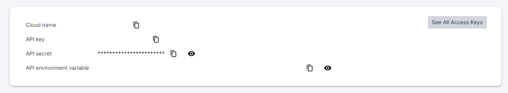

## 🚀 Instalação e configuração do projeto

1. Criar um banco de dados com o nome: `hubusers`

2. Instale as dependências: `npm install`

3. Execute a API: `npm run start:dev`

4. Tem um json com o nome `hubusers.json` para utilizar no `insomnia` se houver necessidade de teste

Por fim, a aplicação estará disponível em `http://localhost:3333`

---

## 🚀 Configurações para o upload de imagens

1. Criar uma conta no cloudinary [(https://console.cloudinary.com/)] é de forma gratuita

2. Configurar as variavéis de ambiente do `.env`

3. Caso tenha dúvidas de como localizar as variavéis, basta acessar a plataforma do cloudinary e selecionar a opção de "Dashboard" no menu lateral, lá estará todos as opções de settings cloudinary do `.env`

4. Com as configurações feitas é só testar o upload na aplicação

5. E para visualizar a imagem no cloudinary é só clinar no "Media Explorer" do menu lateral;

---
