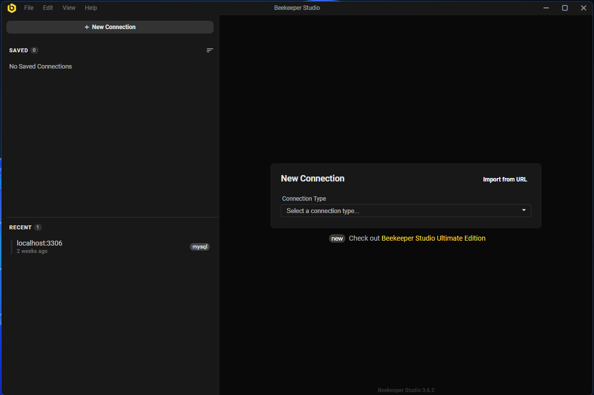
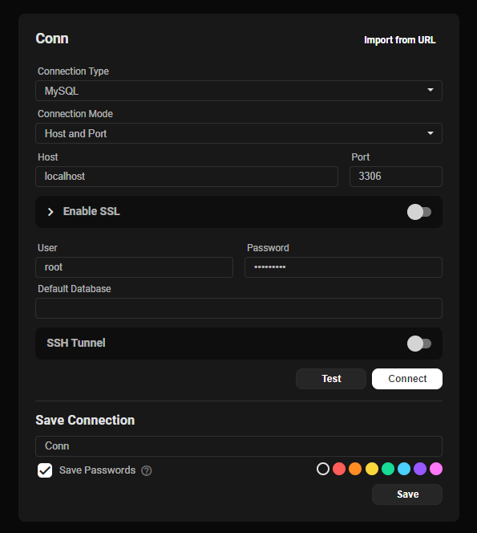
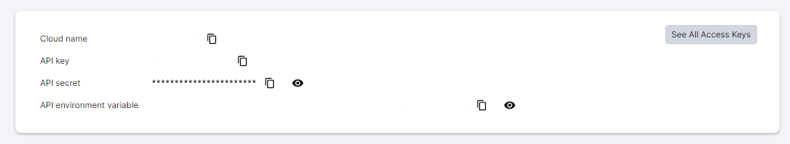

## 🚀 Instalação e configuração do banco

1. Criar a imagem MYSQL no docker: `docker run --name docker-mysql -e MYSQL_ROOT_PASSWORD=123456789 -p 3306:3306 -d mysql`

2. Instalar o beekeeper studio, com ele será simples visualizar se os registros estão sendo salvos corretamente, o arquivo executável do software tá na pasta: `readme`

3. Com o beekeeper instalado, escolha a opção mysql e adicione as configurações da imagem baixada docker

4. Depois de tudo configurado é só clicar em "Connect" e ela irá abrir a tela de query, depois é só rodar o comando: `CREATE DATABASE hubusers;`

5. Por fim, agora é só configurar as variáveis de ambiente com as informações do banco, no projeto tem um aquivo `.env.exemple` renomei somente para `.env`

---

## 🚀 Configurações para o upload de imagens

1. Criar uma conta no cloudinary [(https://console.cloudinary.com/)] é de forma gratuita

2. Configurar as variavéis de ambiente do cloudinary no arquivo `.env`

3. Caso tenha dúvidas de como localizar as variavéis, basta acessar a plataforma do cloudinary e selecionar a opção de "Dashboard" no menu lateral, lá estará todos as opções de settings cloudinary do `.env`

4. Com as configurações feitas é só testar o upload na aplicação

5. E para visualizar a imagem no cloudinary é só clinar no "Media Explorer" do menu lateral;

---

## 🚀 Instalação e configuração do projeto

1. Instale as dependências: `npm install`

2. Execute a API: `npm run start:dev`

3. Tem arquino json na pasta `readme` com o nome `hubusers-crud.json` para utilizar no `insomnia` se houver necessidade de teste

Por fim, a aplicação estará disponível em `http://localhost:3333`

---
